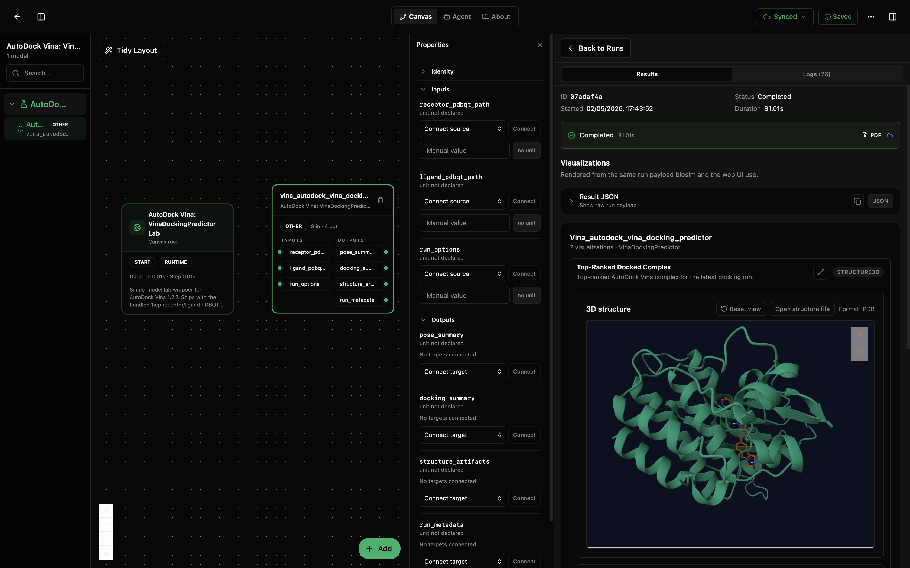
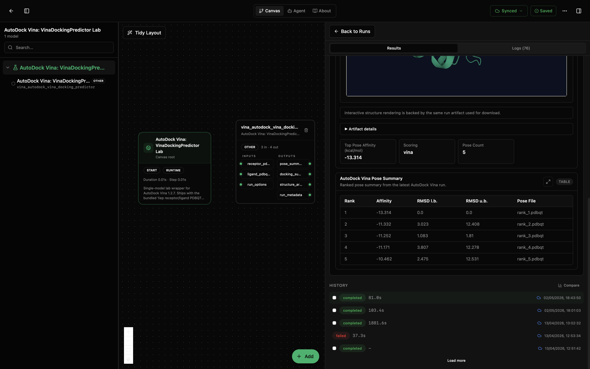

# AutoDock Vina: VinaDockingPredictor Lab

This lab runs a single AutoDock Vina docking job for one prepared receptor and one prepared ligand. Both inputs are PDBQT files. The lab ships with the bundled `1iep` complex so a fresh run produces real ranked poses and a structural artifact without any extra setup.

The wrapper boots the pinned official AutoDock Vina 1.2.7 release in managed runtime mode (the binaries are downloaded once and cached), runs classic CPU-backed Vina against the configured search box, and returns ranked poses, an aggregate docking summary, and merged structural files for the top-ranked pose.

This lab is for single-complex docking only. It does not prepare receptors from PDB, prepare ligands from SDF or SMILES, run AutoDock-GPU, or schedule virtual-screening batches. Those belong in adjacent labs.

## What You'll See

The lab opens as a small canvas with one Vina docking node and a run-results panel. With the bundled defaults, the run produces:

- a ranked pose table sorted by binding affinity,
- a structure3d view of the top-ranked pose merged onto the receptor,
- a docking summary with run metadata, search box, and Vina stdout/stderr tails.

The first screenshot shows the canvas, node inputs and outputs, and the structure3d view for the top-ranked docked complex. The second scrolls down to the artifact details and ranked pose table for the same run.





## How to Read the Visualizations

The pose ranking table lists each Vina pose with its predicted binding affinity (kcal/mol), the lower-bound RMSD to the best pose, and the upper-bound RMSD. Lower (more negative) affinity is a stronger predicted bind. RMSDs near zero for the top entry are normal because Vina ranks against itself. In the screenshot, the bundled `1iep` run reports five poses and a top-ranked affinity of -13.314 kcal/mol.

The structure3d view shows the receptor with the highest-affinity pose merged in as `top_rank_complex.pdb`. Use it to sanity-check that the ligand sits inside the configured search box and inside a plausible pocket. If the ligand sits outside the receptor, the search box is wrong, not the docking. The shown default run places the ligand inside the receptor pocket and exposes the same structure artifact for download.

The docking summary captures the search box, exhaustiveness, scoring function, and the number of poses requested. The run metadata reports which Vina version executed, where the managed runtime cached its binaries, the truncated stdout/stderr from the CLI, and `status: ok` or `status: error` so a failed run is still inspectable.

## What This Lab Contains

- `lab.yaml` describes the lab, exposes its inputs and outputs, and pins the bundled defaults.
- `wiring-layout.json` places the model on the canvas.
- `model/model.yaml` describes the model package, parameters, and ports.
- `model/src/vina_docking_predictor.py` contains the wrapper, managed runtime bootstrap, and visualization shaping.
- `model/data/1iep/` ships the receptor PDBQT, ligand PDBQT, search-box reference files, and a prepared receptor PDB.
- `model/tests/` checks the wrapper, manifest, and lab contract.

## Inputs

The model accepts three input signals. Each one falls back to the matching `default_*` parameter in `lab.yaml` when the signal is not wired, which is what makes the lab runnable out of the box.

- `receptor_pdbqt_path` (path): prepared receptor PDBQT file. Defaults to `data/1iep/1iep_receptor.pdbqt`.
- `ligand_pdbqt_path` (path): prepared ligand PDBQT file. Defaults to `data/1iep/1iep_ligand.pdbqt`.
- `run_options` (record): Vina CLI options. Defaults to the 1iep-tuned box and exhaustiveness 32.
  - `box_center` (Å, list of 3): search-box center, in receptor coordinates.
  - `box_size` (Å, list of 3): search-box edge lengths.
  - `exhaustiveness` (int): Vina sampling effort. Higher is slower and more thorough.
  - `n_poses` (int): how many poses to return.
  - `energy_range` (kcal/mol): max affinity gap from the top pose to keep a pose in the output.
  - `cpu` (int): CPU thread budget. `0` lets Vina decide.
  - `scoring` (str): Vina scoring function (`vina`, `vinardo`, `ad4`).

## Outputs

- `pose_summary` (record): ranked poses with affinity, RMSD lower/upper bounds, and per-pose file pointers.
- `docking_summary` (record): aggregate stats across the pose set including the search box and Vina settings used.
- `structure_artifacts` (record): file-backed artifacts including the merged `top_rank_complex.pdb` consumed by the structure3d renderer.
- `run_metadata` (record): runtime metadata, Vina version, runtime/cache directories, truncated stdout/stderr, and `status: ok` or `status: error`.

## Running in Biosimulant Desktop

Import the lab once with the Biosim CLI, then open it from the desktop app. The bundled `1iep` defaults mean the first run requires no parameter editing.

```bash
biosimulant labs import labs/vina-autodock-vina-docking-predictor
```

To dock a different complex, override the inputs in the lab's run sidebar (or wire them to a source module that produces PDBQT paths). The model treats wired input signals as overrides on top of the defaults, so partial overrides work too.

## Notes

- Managed runtime mode is required for remote CPU execution on Modal. System mode (using a pre-installed Vina) is supported for local debugging.
- The lab's `runtime.duration` is intentionally short. Vina is event-driven; the wrapper runs the docking job inside a single advance window.
- The lab sets `runtime.settle_steps: 1` so the downstream visualization module can consume the final structure artifacts without extending simulated time.
- `model/data/1iep/` is shipped as part of the model package so the defaults resolve in remote runs too.
